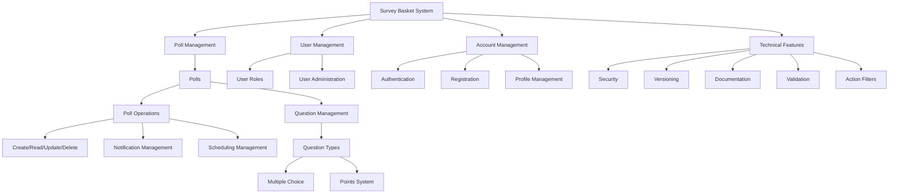
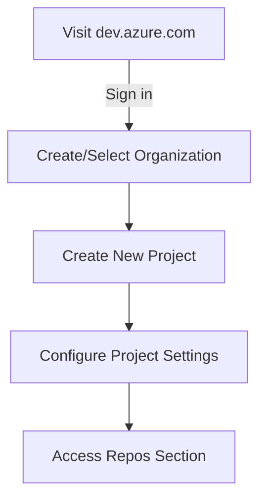
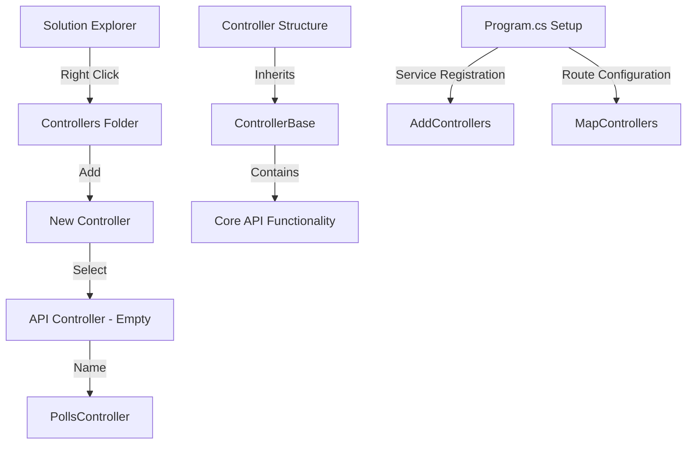
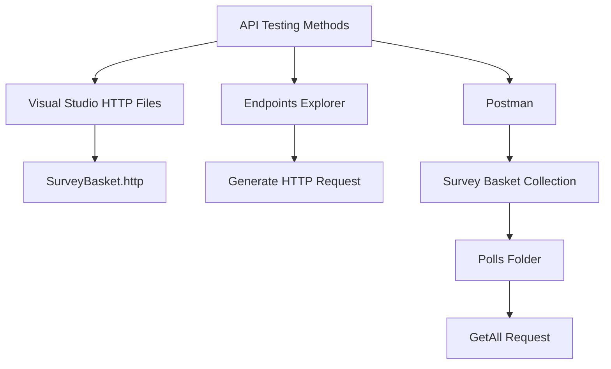
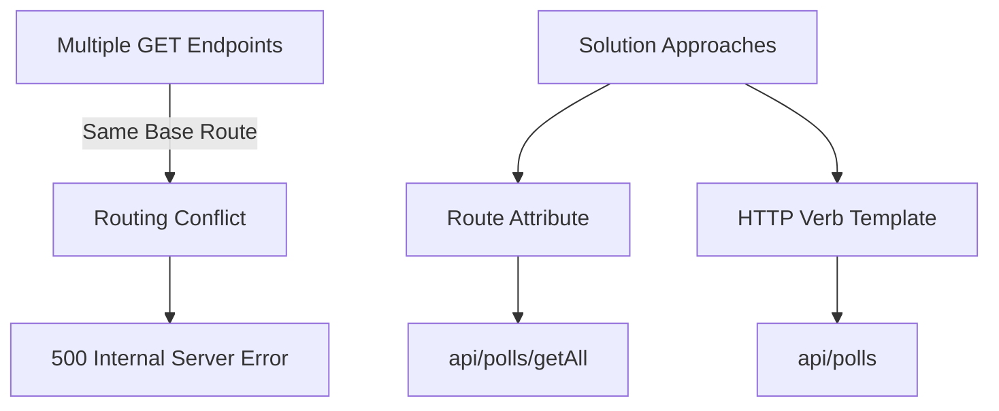

# Survey Basket Project Documentation

## Project Overview

Survey Basket is a comprehensive polling and survey management system that allows administrators to create and manage polls while enabling users to participate in them. The system implements a modular approach to development, focusing on building core functionalities incrementally.

## System Architecture

### Core Modules

1. **Poll Management**
   - Create, read, update, and delete polls
   - Schedule poll activation dates
   - Manage questions and answers
   - Points system integration
   - Notification system for active polls

2. **User Management**
   - User administration
   - Role management
   - Access control
   - User status management (Lock/Unlock)

3. **Account Management**
   - User registration
   - Account confirmation
   - Login system
   - Password management
   - Profile updates

### Technical Features

| Feature | Description | Implementation Phase |
|---------|-------------|---------------------|
| Security | Authentication, Authorization, Claims | With Poll Module |
| Versioning | API versioning | After Poll Module |
| Documentation | API documentation, Swagger | With Poll Module |
| Validation | Model validation, Action filters | With Poll Module |
| Service Layer | Business logic separation | After CRUD |

## Development Approach

### Phase 1: Poll Module Implementation
1. Basic CRUD operations
2. Model binding and validation
3. Action filters implementation
4. Security integration
5. API versioning
6. Documentation
7. Service layer separation

### Phase 2: Additional Modules
- User management implementation
- Account management features
- Role-based access control
- Additional poll features

## Technical Implementation Details

### Poll Module Specifications
- Scheduled activation dates
- Notification system
- MCQ support
- Points system
- User response tracking

### Security Implementation
```csharp
// Example security implementation structure
public class AuthorizationHandler
{
    // Authorization logic
}

public class SecurityMiddleware
{
    // Security middleware configuration
}
```

### Service Layer Pattern
```csharp
public interface IPollService
{
    Task<Poll> CreatePoll(Poll poll);
    Task<IEnumerable<Poll>> GetActivePolls();
    // Additional service methods
}
```

## Project Timeline

1. **Week 1-2**: Poll Module CRUD
2. **Week 3**: Security Integration
3. **Week 4**: Documentation & Versioning
4. **Week 5+**: Additional Modules

## Best Practices

1. **Code Organization**
   - Separate business logic into services
   - Use dependency injection
   - Implement repository pattern

2. **Security**
   - Implement proper authentication
   - Use role-based authorization
   - Secure endpoints appropriately

3. **Documentation**
   - Use XML comments
   - Maintain API documentation
   - Document architectural decisions

## Conclusion

This project follows an incremental development approach, focusing on building core functionalities first through the Poll module. This approach ensures that developers learn key concepts early and can apply them throughout the rest of the project development.

---

## Getting Started

### Prerequisites
- .NET Core SDK
- SQL Server
- Visual Studio/VS Code

### Setup Instructions
1. Clone repository
2. Configure database
3. Run migrations
4. Start development server


# Setting Up Azure DevOps for Your Project

## Prerequisites
- Visual Studio installed
- Microsoft account
- Azure DevOps account

## Step-by-Step Setup Guide

### 1. Microsoft Account Setup
- Sign in to Visual Studio using your Microsoft account
- Navigate to [Visual Studio DevOps](https://dev.azure.com)
- Sign in with the same Microsoft account

### 2. Azure DevOps Organization Setup


### 3. Project Creation in Azure DevOps
1. Click "New Project"
2. Enter project details:
   - Name
   - Description (optional)
   - Visibility (Public/Private)
   - Version control (Git)
3. Click "Create"

### 4. Repository Setup
| Step | Location | Action |
|------|-----------|--------|
| 1 | Azure DevOps | Navigate to Repos > Files |
| 2 | Visual Studio | Open your project |
| 3 | Visual Studio | Go to Git Changes |
| 4 | Visual Studio | Click "Create Git Repository" |

### 5. Connecting Local Repository to Azure DevOps
1. In Azure DevOps:
   - Navigate to your repository
   - Click "Clone"
   - Copy the remote URL

2. In Visual Studio:
   ```
   Git Changes -> Create Git Repository -> Existing Remote
   Paste the copied URL
   Click Create and Push
   ```

### 6. Authentication
- You may be prompted to sign in again
- Use your Microsoft account credentials
- Verify the connection is established

### 7. Verification
1. Return to Azure DevOps portal
2. Navigate to Repos > Files
3. Verify your project files are now visible

## Common Issues and Solutions

| Issue | Solution |
|-------|----------|
| Authentication Failed | Re-enter credentials in Visual Studio |
| Push Failed | Check remote URL and permissions |
| Repository Not Found | Verify organization and project names |

## Best Practices

1. **Initial Setup**
   - Initialize with .gitignore
   - Add a README.md
   - Configure branch policies

2. **Commit Strategy**
   - Make meaningful commits
   - Use clear commit messages
   - Commit frequently

3. **Branch Management**
   - Create development branches
   - Protect main branch
   - Use feature branches

## Next Steps
- Set up build pipelines
- Configure release management
- Add team members
- Set up work items and boards

---

**Note**: Remember to never commit sensitive information like connection strings or API keys. Use Azure DevOps secure variables for sensitive data.


# API Controller Implementation Guide

## Creating the Controller

### Setup Steps
1. In Solution Explorer:
   - Right-click Controllers folder
   - Add → Controller
   - Select "API Controller - Empty"
   - Name it `PollsController` (plural)



## Controller Architecture

### Class Hierarchy
| Class | Purpose | Used In |
|-------|----------|---------|
| ControllerBase | Abstract base class with core API functionality | Web API |
| Controller | Inherits from ControllerBase + adds MVC features | MVC |
| PollsController | Our API controller inheriting from ControllerBase | Our Project |

### Key Attributes
```csharp
[ApiController]
[Route("api/[controller]")]
public class PollsController : ControllerBase
{
    // Controller actions go here
}
```

### Controller Base vs Controller
- **ControllerBase**:
  - Abstract class containing essential API functionality
  - Used for API controllers
  - Lightweight and focused on API operations
  
- **Controller**:
  - Inherits from ControllerBase
  - Adds MVC-specific features (views, etc.)
  - Not needed for API projects

## Program.cs Configuration

### Service Registration
```csharp
builder.Services.AddControllers();
```
- Registers controller services
- Essential for controller functionality
- Must be called before building the application

### Route Configuration
```csharp
app.MapControllers();
```
- Scans all controllers in the project
- Builds route table
- Maps incoming requests to appropriate controllers

## Routing System

### API Route Structure
- Base URL: `https://localhost:port`
- API Prefix: `/api`
- Controller Segment: `/[controller]`
- Full Example: `https://localhost:5001/api/polls`

### Route Attribution
```csharp
[Route("api/[controller]")]  // Class-level route
public class PollsController : ControllerBase
{
    [HttpGet]  // Action-level route
    public IActionResult Get()
    {
        // Implementation
    }
}
```

## Key Differences from MVC

| Feature | Web API | MVC |
|---------|---------|-----|
| Base Class | ControllerBase | Controller |
| View Support | No | Yes |
| Route Definition | Attribute-based | Can use conventional routing |
| Response Format | JSON/XML by default | Views/Partial Views |

## Best Practices

1. **Naming Conventions**
   - Use plural nouns for controller names
   - Keep domain models singular
   - Use descriptive action names

2. **Route Design**
   - Use consistent route patterns
   - Include API version when needed
   - Keep routes RESTful

3. **Controller Organization**
   - One responsibility per controller
   - Group related actions together
   - Keep controllers focused and lean

## Common Implementation

```csharp
[ApiController]
[Route("api/[controller]")]
public class PollsController : ControllerBase
{
    private readonly ILogger<PollsController> _logger;
    
    public PollsController(ILogger<PollsController> logger)
    {
        _logger = logger;
    }
    
    // Action methods go here
}
```

## Next Steps
- Implement CRUD operations
- Add action methods
- Configure model binding
- Set up validation
- Implement error handling

---

**Note**: Remember to maintain consistency in your routing patterns and follow RESTful conventions when designing your API endpoints.


# Implementing Your First API Endpoint

## Project Structure Setup

### Adding the Model
1. Create new folder: `Models`
2. Add new class: `Poll.cs`

```csharp
public class Poll
{
    public int Id { get; set; }
    public string Title { get; set; } = string.Empty;
    public string Description { get; set; } = string.Empty;
}
```

### Controller Implementation
```csharp
[ApiController]
[Route("api/[controller]")]
public class PollsController : ControllerBase
{
    // In-memory database simulation
    private readonly List<Poll> _polls = new();

    [HttpGet]
    public IActionResult GetAll()
    {
        return Ok(_polls);
    }
}
```

## Testing Approaches



### 1. Visual Studio HTTP Files
- Create `SurveyBasket.http` file
- Structure:
```http
GET https://localhost:port/api/polls
```
- Features:
  - Send request directly from VS
  - View response status, time, body, headers
  - Multiple requests in one file

### 2. Endpoints Explorer
| Feature | Description |
|---------|-------------|
| Scanning | Automatically scans all endpoints |
| Generation | Can generate HTTP request files |
| Organization | Groups by controller |
| Visibility | Shows HTTP verbs and routes |

### 3. Postman Setup

1. **Collection Creation**
   ```
   Collection: Survey Basket
   └── Folder: Polls
       └── Request: GetAll
   ```

2. **Request Configuration**
   - Method: GET
   - URL: `{{baseUrl}}/api/polls`
   - Save in Polls folder

## Testing Flow

### Local Testing Steps
1. Launch application
2. Choose testing method:
   - VS HTTP file
   - Endpoints Explorer
   - Postman
3. Send request
4. Verify empty array response (initial state)

### Response Structure
```json
{
    "statusCode": 200,
    "body": []
}
```

## Best Practices

1. **Endpoint Organization**
   - Use meaningful names
   - Group related endpoints
   - Maintain consistent routing

2. **Testing Strategy**
   - Test with multiple tools
   - Save request templates
   - Organize collections logically

3. **Code Structure**
   - Separate models from controllers
   - Use initialization for properties
   - Return appropriate status codes

## Common Testing Scenarios

| Scenario | Tool | Advantage |
|----------|------|-----------|
| Quick Testing | VS HTTP Files | Integrated in IDE |
| Development | Endpoints Explorer | Auto-discovery |
| Comprehensive | Postman | Advanced features |

## Next Steps
- Add data manipulation endpoints
- Implement error handling
- Add request validation
- Configure response formatting
- Set up automated testing

## Notes for Future Implementation
- Move models to separate project
- Implement proper database
- Add service layer
- Implement repository pattern

---

**Note**: While in-memory storage works for development, implement proper database storage for production use.


# Managing Multiple GET Endpoints

## Problem Description


## Problematic Code Example
```csharp
[ApiController]
[Route("api/[controller]")]
public class PollsController : ControllerBase
{
    private readonly List<Poll> _polls = new();

    [HttpGet]  // Conflict!
    public IActionResult GetAll()
    {
        return Ok(_polls);
    }

    [HttpGet]  // Conflict!
    public IActionResult Test()
    {
        return Ok(_polls);
    }
}
```

## Solution Approaches

### 1. Using Route Attribute
```csharp
[ApiController]
[Route("api/[controller]")]
public class PollsController : ControllerBase
{
    [HttpGet]
    [Route("getAll")]  // Results in: api/polls/getAll
    public IActionResult GetAll()
    {
        return Ok(_polls);
    }

    [HttpGet]
    [Route("test")]    // Results in: api/polls/test
    public IActionResult Test()
    {
        return Ok(_polls);
    }
}
```

### 2. Using HTTP Verb Template
```csharp
[ApiController]
[Route("api/[controller]")]
public class PollsController : ControllerBase
{
    [HttpGet("getAll")]  // Cleaner syntax for: api/polls/getAll
    public IActionResult GetAll()
    {
        return Ok(_polls);
    }

    [HttpGet("test")]   // Cleaner syntax for: api/polls/test
    public IActionResult Test()
    {
        return Ok(_polls);
    }
}
```

## Route Comparison

| Approach | Syntax | Result | Best For |
|----------|--------|--------|----------|
| Route Attribute | `[Route("getAll")]` | `api/polls/getAll` | Complex routing rules |
| HTTP Verb Template | `[HttpGet("getAll")]` | `api/polls/getAll` | Simple, clean routes |

## Common Mistakes to Avoid

1. **Duplicate Routes**
   ```csharp
   // DON'T DO THIS
   [HttpGet]
   [HttpGet]  // Conflict!
   ```

2. **Ambiguous Routes**
   ```csharp
   // DON'T DO THIS
   [HttpGet("items")]
   [HttpGet("items/")]  // Ambiguous!
   ```

3. **Missing Route Specifications**
   ```csharp
   // DON'T DO THIS
   [HttpGet]
   [HttpGet]  // No route differentiation
   ```

## Best Practices

1. **Route Naming**
   - Use meaningful names
   - Follow REST conventions
   - Keep routes lowercase
   - Use hyphens for multi-word routes

2. **Route Structure**
   - Keep routes simple
   - Use consistent patterns
   - Avoid deep nesting

3. **Documentation**
   ```csharp
   /// <summary>
   /// Gets all polls
   /// </summary>
   [HttpGet("getAll")]
   public IActionResult GetAll()
   ```

## Testing Routes

### Swagger
```http
GET /api/polls/getAll
GET /api/polls/test
```

### Postman
1. Create separate requests for each endpoint
2. Verify different URLs
3. Test for proper responses

## Troubleshooting

| Issue | Possible Cause | Solution |
|-------|---------------|----------|
| 500 Error | Duplicate routes | Add unique route templates |
| 404 Error | Incorrect route | Verify route template |
| Ambiguous Match | Similar routes | Make routes distinct |

## Next Steps
- Add route parameters
- Implement query strings
- Add route constraints
- Configure route templates
- Add response types

---

**Note**: Choose the routing approach that best fits your project's conventions and maintain consistency throughout your API.

The HTTP Verb Template approach (`[HttpGet("getAll")]`) is generally preferred for its clarity and conciseness unless you need complex routing rules.
