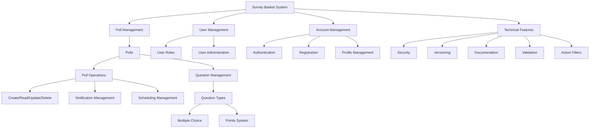

# Survey Basket Project Documentation

## Project Overview

Survey Basket is a comprehensive polling and survey management system that allows administrators to create and manage polls while enabling users to participate in them. The system implements a modular approach to development, focusing on building core functionalities incrementally.

## System Architecture

### Core Modules

1. **Poll Management**
   - Create, read, update, and delete polls
   - Schedule poll activation dates
   - Manage questions and answers
   - Points system integration
   - Notification system for active polls

2. **User Management**
   - User administration
   - Role management
   - Access control
   - User status management (Lock/Unlock)

3. **Account Management**
   - User registration
   - Account confirmation
   - Login system
   - Password management
   - Profile updates

### Technical Features

| Feature | Description | Implementation Phase |
|---------|-------------|---------------------|
| Security | Authentication, Authorization, Claims | With Poll Module |
| Versioning | API versioning | After Poll Module |
| Documentation | API documentation, Swagger | With Poll Module |
| Validation | Model validation, Action filters | With Poll Module |
| Service Layer | Business logic separation | After CRUD |

## Development Approach

### Phase 1: Poll Module Implementation
1. Basic CRUD operations
2. Model binding and validation
3. Action filters implementation
4. Security integration
5. API versioning
6. Documentation
7. Service layer separation

### Phase 2: Additional Modules
- User management implementation
- Account management features
- Role-based access control
- Additional poll features

## Technical Implementation Details

### Poll Module Specifications
- Scheduled activation dates
- Notification system
- MCQ support
- Points system
- User response tracking

### Security Implementation
```csharp
// Example security implementation structure
public class AuthorizationHandler
{
    // Authorization logic
}

public class SecurityMiddleware
{
    // Security middleware configuration
}
```

### Service Layer Pattern
```csharp
public interface IPollService
{
    Task<Poll> CreatePoll(Poll poll);
    Task<IEnumerable<Poll>> GetActivePolls();
    // Additional service methods
}
```

## Project Timeline

1. **Week 1-2**: Poll Module CRUD
2. **Week 3**: Security Integration
3. **Week 4**: Documentation & Versioning
4. **Week 5+**: Additional Modules

## Best Practices

1. **Code Organization**
   - Separate business logic into services
   - Use dependency injection
   - Implement repository pattern

2. **Security**
   - Implement proper authentication
   - Use role-based authorization
   - Secure endpoints appropriately

3. **Documentation**
   - Use XML comments
   - Maintain API documentation
   - Document architectural decisions

## Conclusion

This project follows an incremental development approach, focusing on building core functionalities first through the Poll module. This approach ensures that developers learn key concepts early and can apply them throughout the rest of the project development.

---

## Getting Started

### Prerequisites
- .NET Core SDK
- SQL Server
- Visual Studio/VS Code

### Setup Instructions
1. Clone repository
2. Configure database
3. Run migrations
4. Start development server
